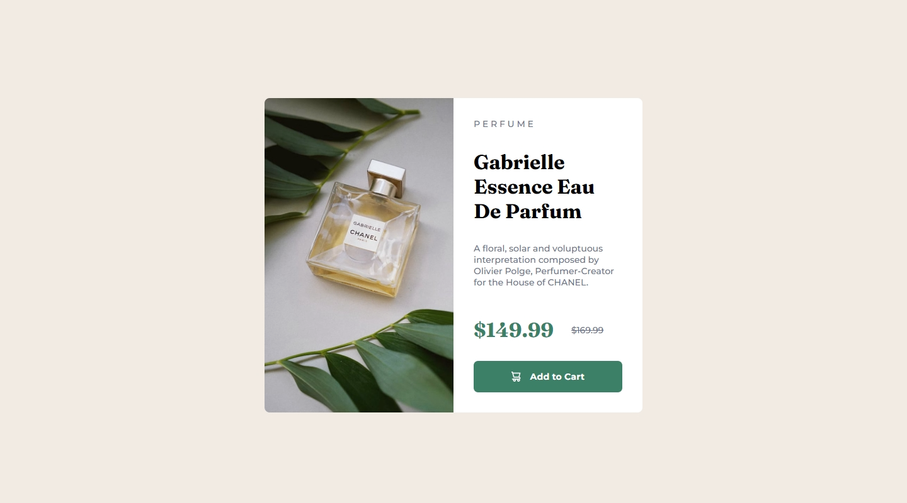

# Frontend Mentor - Product preview card component solution

This is a solution to the [Product preview card component challenge on Frontend Mentor](https://www.frontendmentor.io/challenges/product-preview-card-component-GO7UmttRfa). Frontend Mentor challenges help you improve your coding skills by building realistic projects. 

## Table of contents

- [Overview](#overview)
  - [The challenge](#the-challenge)
  - [Screenshot](#screenshot)
  - [Links](#links)
- [My process](#my-process)
  - [Built with](#built-with)
  - [What I learned](#what-i-learned)
  - [Continued development](#continued-development)
  - [Useful resources](#useful-resources)
- [Author](#author)

**Note: Delete this note and update the table of contents based on what sections you keep.**

## Overview

### The challenge

Users should be able to:

- View the optimal layout depending on their device's screen size
- See hover and focus states for interactive elements

### Screenshot

### Links

- Solution URL: [Add solution URL here](https://your-solution-url.com)
- Live Site URL: [Add live site URL here](https://your-live-site-url.com)

## My process

### Built with

- Semantic HTML5 markup
- CSS custom properties
- Flexbox
- CSS Grid
- Mobile-first workflow

**Note: These are just examples. Delete this note and replace the list above with your own choices**

### What I learned

Refine CSS abilities combining CSS Grid and Flexbox to achieve the design goals. Have a more fluid, responsive layout using and experimenting max(), min() and clamp for width, height and font sizes.

### Continued development

Continue practicing my skills and improve my workflow, gather best practices and play around later on with animations and transitions.

### Useful resources

- [CSS min() Function](https://www.w3schools.com/cssref//func_min.php) - This helped me understand better the min() function as it became confusing at times.
- [CSS max() Function](https://www.w3schools.com/cssref//func_max.php) - This is helped me clear my confusion on the max() function.

## Author

- GitHub - [winceh7](https://github.com/winceh7)
- Frontend Mentor - [@winceh7](https://www.frontendmentor.io/profile/winceh7)